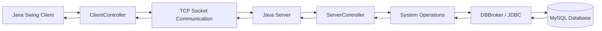

# 🦷 Dental Clinic Management System


A Java desktop client-server application for managing the daily operations of a dental clinic.

The system was developed as my Bachelor's thesis at the **Faculty of Organizational Sciences, University of Belgrade**. It provides functionality for managing clients, dental services and appointments through a Java Swing graphical user interface, while the application logic and database communication are handled by a separate server application.

---

## 📌 Overview

The application was designed using a **client-server and three-tier architecture**.

The system is divided into three main projects:

- `StomatologijaKlijent` – client application and Java Swing user interface
- `StomatologijaServer` – server, business logic and database access
- `StomatologijaZajednicki` – shared domain classes and communication objects

The client and server communicate using **TCP sockets** and serialized Java objects.

The server processes requests, executes business operations and communicates with a **MySQL database through JDBC**.

---

## ✨ Features

### Authentication

- Dentist login
- Username and password validation
- Prevention of multiple simultaneous logins for the same dentist
- User session management
- Logout functionality

### Client Management

- Add new clients
- Search clients by first name, last name and email
- View client details
- Update client information
- Delete clients
- Assign client types
- Email validation
- Phone number validation
- Duplicate email and phone number validation

### Dental Service Management

- Add dental services
- Search services
- Update services
- Delete services
- Define service name, description, price and duration

### Appointment Management

- Create appointments
- Search appointments by client
- View appointment details
- Update appointments
- Delete appointments
- Add multiple dental services to an appointment
- Add notes for individual appointment items
- Automatic price calculation
- Automatic client discount calculation
- Automatic final price calculation
- Validation that appointments cannot be created in the past

### Server Administration

- Start and stop the server
- Visual server status
- Database configuration
- Progress indicators during server startup and shutdown
- Support for multiple client connections using threads

---

# 🖥️ Application Preview

## Main Application

The main client interface is the central part of the application and provides access to appointment, client and service management.


---

## Appointment Management

Appointments can contain multiple dental services. The system calculates the total amount, applicable client discount and final price.


### Appointment Search

Existing appointments can be displayed and filtered using client information.


---

## Client Management

Clients can be searched using multiple criteria including first name, last name and email.


Detailed client information can be viewed, updated or deleted.


---

## Authentication

Dentists must authenticate before accessing the application's functionality.


---

## Server Application

The server application handles incoming client connections, application logic and database communication.


---

# 🏗️ Architecture

The application uses a **three-tier client-server architecture**.



### Communication Flow

A typical request follows this path:

```text
Java Swing GUI
      ↓
ClientController
      ↓
Request Object
      ↓
TCP Socket
      ↓
ThreadClient
      ↓
ServerController
      ↓
System Operation
      ↓
DBBroker
      ↓
MySQL Database
```

The result is returned to the client through a serialized `Response` object.

---

# 🔌 Client-Server Communication

The client connects to the server through a TCP socket.

The server listens on:

```text
localhost:9000
```

Communication between the client and server is implemented using:

- `Socket`
- `ServerSocket`
- `ObjectInputStream`
- `ObjectOutputStream`
- Java Object Serialization
- `Request`
- `Response`
- operation codes

The `Request` object contains the requested operation and the data that should be processed.

The server processes the request and sends a `Response` object back to the client.

---

# 🧵 Multithreading

The server supports multiple client connections using Java threads.

`ThreadServer` continuously listens for incoming connections.

For every connected client, the server creates a separate:

```text
ThreadClient
```

which receives and processes requests independently.

This allows multiple application clients to communicate with the server.

Some client-side table models also use background threads to periodically refresh displayed data.

---

# ⚙️ Business Logic

Business operations are implemented using separate **System Operation classes**.

Examples include:

```text
SOLogin

SOAddKlijent
SOUpdateKlijent
SODeleteKlijent
SOGetAllKlijent

SOAddUsluga
SOUpdateUsluga
SODeleteUsluga
SOGetAllUsluga

SOAddTermin
SOUpdateTermin
SODeleteTermin
SOGetAllTermin
```

All system operations extend:

```java
AbstractSO
```

`AbstractSO` provides a common execution workflow:

```text
Validate request
      ↓
Execute operation
      ↓
Commit transaction
```

If an exception occurs:

```text
Exception
    ↓
Rollback transaction
```

This centralizes validation and transaction handling for business operations.

---

# 🗄️ Database Layer

Database communication is handled by the `DBBroker` class.

`DBBroker` is implemented as a singleton and provides generic database operations such as:

- SELECT
- INSERT
- UPDATE
- DELETE
- transaction commit
- transaction rollback

Database access is implemented using **JDBC**.

The application uses a MySQL database named:

```text
stomatologija
```

The repository contains the SQL script required to create and populate the database:

```text
stomatologija.sql
```

---

# 🗃️ Database Model

The database contains the following main entities:

| Entity | Description |
|---|---|
| `Stomatolog` | Dentist account and authentication data |
| `Klijent` | Dental clinic client |
| `TipKlijenta` | Client category used for discounts |
| `Usluga` | Dental service |
| `Termin` | Dental appointment |
| `StavkaTermina` | Individual service included in an appointment |
| `Sertifikat` | Dentist certificate |
| `StomatologSertifikat` | Relationship between dentists and certificates |

### Main Relationships

```text
Stomatolog
    │
    └── Termin

Klijent
    │
    ├── TipKlijenta
    │
    └── Termin

Termin
    │
    └── StavkaTermina
            │
            └── Usluga

Stomatolog
    │
    └── StomatologSertifikat
                │
                └── Sertifikat
```

---

# 🧩 Domain Model

The main domain classes are:

```text
Stomatolog
Klijent
TipKlijenta
Usluga
Termin
StavkaTermina
Sertifikat
StomatologSertifikat
```

Domain classes extend a common:

```java
AbstractDomainObject
```

which defines methods used by the generic database broker for:

- table names
- SQL aliases
- joins
- insert columns
- insert values
- update values
- query conditions
- object mapping

This allows database operations to work with different domain objects through a shared abstraction.

---

# 🧪 Testing

The project includes automated tests implemented using **JUnit 4**.

The following core system operations are covered by automated tests:

### `SOLoginTest`

Tests include:

- valid login object
- invalid login object
- successful login
- incorrect password
- nonexistent username
- prevention of duplicate login sessions

### `SOAddKlijentTest`

Tests include:

- valid client data
- invalid object type
- invalid email format
- invalid phone number
- duplicate email
- duplicate phone number
- successful client creation
- unsuccessful client creation

### `SOAddTerminTest`

Tests include:

- valid appointment
- invalid object type
- appointment date in the past
- appointment without service items
- successful appointment creation
- unsuccessful appointment creation

### `SOUpdateTerminTest`

Tests include:

- valid appointment update
- invalid object type
- appointment date in the past
- appointment without service items
- successful update of appointment data
- unsuccessful appointment update

Some tests execute system operations against the configured database and clean up generated test data after execution.

---

# 🛠️ Technologies

| Technology | Purpose |
|---|---|
| **Java** | Main programming language |
| **Java Swing** | Desktop graphical user interface |
| **JDBC** | Database communication |
| **MySQL** | Relational database |
| **Java Sockets** | Client-server communication |
| **Java Serialization** | Sending objects between client and server |
| **Multithreading** | Handling multiple clients and background refresh |
| **JUnit 4** | Automated testing |
| **Apache NetBeans** | Development environment |
| **SQL** | Database creation and manipulation |

---

# 📂 Project Structure

```text
Stomatologija/
│
├── images/
│   ├── glavna_forma.png
│   ├── klijent_detalji.png
│   ├── klijent_pretraga.png
│   ├── login.png
│   ├── server_pokrenut.png
│   ├── termin_pretraga.png
│   └── termin_prikaz.png
│
├── StomatologijaKlijent/
│
├── StomatologijaServer/
│
├── StomatologijaZajednicki/
│
├── mysql-connector-j-9.5.0.jar
├── stomatologija.drawio
├── stomatologija.png
├── stomatologija.sql
│
└── README.md
```

### `StomatologijaKlijent`

Contains the client-side application:

```text
GUI Forms
ClientController
Session
Table Models
Socket Communication
```

### `StomatologijaServer`

Contains the server-side application:

```text
Server GUI
ServerController
ThreadServer
ThreadClient
System Operations
DBBroker
JUnit Tests
```

### `StomatologijaZajednicki`

Contains classes shared between the client and server:

```text
Domain Objects
Request
Response
Operation
ResponseStatus
```

---

# 🚀 Running the Project

## Requirements

Before running the application, make sure you have:

- Java JDK
- MySQL Server
- Apache NetBeans
- MySQL JDBC Connector

---

## 1. Create the Database

Import:

```text
stomatologija.sql
```

into MySQL.

The script creates the required database structure and initial data.

---

## 2. Open the Projects

Open the following projects in Apache NetBeans:

```text
StomatologijaZajednicki
StomatologijaServer
StomatologijaKlijent
```

Make sure that the client and server projects have access to the shared `StomatologijaZajednicki` project.

---

## 3. Configure the Database

Start the server application and configure the database connection using:

```text
Konfiguracija baze
```

Enter the required:

```text
Database name
Username
Password
```

The configuration is stored in:

```text
dbconfig.properties
```

---

## 4. Start the Server

Run:

```text
StomatologijaServer
```

and click:

```text
Pokreni server
```

After the server starts successfully, it listens for client connections on:

```text
localhost:9000
```

---

## 5. Start the Client

Run:

```text
StomatologijaKlijent
```

The login window will appear.

Authenticate using a dentist account stored in the database.

After successful authentication, the main application interface will be displayed.

---

# 🎓 Academic Project

This project was developed as a **Bachelor's thesis** at:

**University of Belgrade**  
**Faculty of Organizational Sciences**

### Thesis

**Software System for Monitoring the Work of a Dental Practice in Java Environment**

Original title:

> Softverski sistem za praćenje rada stomatološke ordinacije u Java okruženju

**Year:** 2026

The project demonstrates the practical implementation of:

- Object-Oriented Programming
- Desktop Application Development
- Client-Server Architecture
- Three-Tier Architecture
- Relational Database Design
- Socket Communication
- Multithreading
- Transaction Management
- Generic Database Access
- Automated Testing

---

# 👤 Author

**Uroš Đokić**

Bachelor's graduate in Information Systems and Technologies  
Faculty of Organizational Sciences  
University of Belgrade
