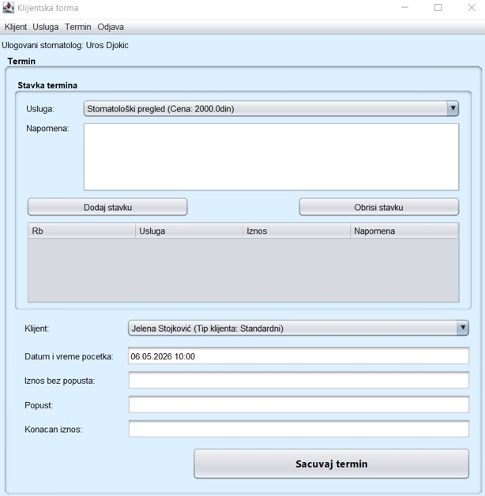
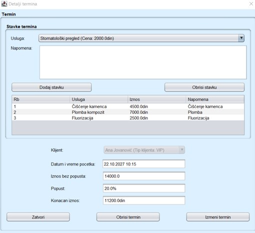
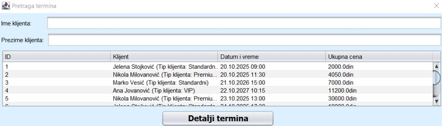
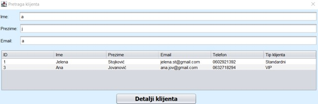
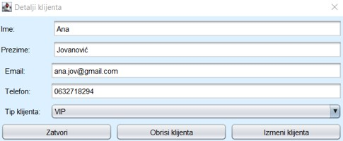
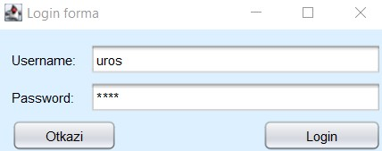
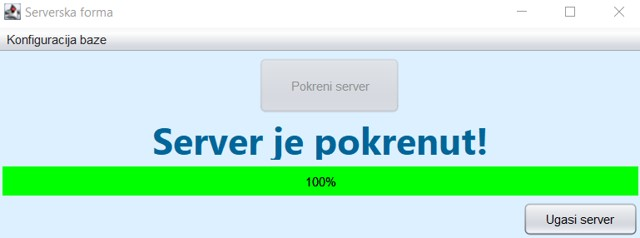
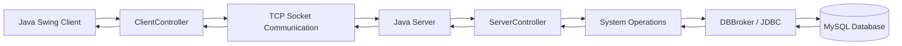
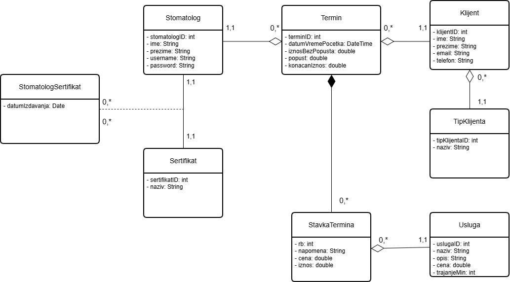

# 🦷 Dental Clinic Management System


A Java desktop client-server application for managing the daily operations of a dental clinic.

The system was developed as my Bachelor's thesis at the **Faculty of Organizational Sciences, University of Belgrade**.

It provides functionality for managing clients, dental services and appointments through a Java Swing graphical user interface, while business logic and database communication are handled by a separate server application.

---

## 📌 Overview

The application follows a **client-server architecture** with a separation between the presentation, business logic and database layers.

The system is divided into three NetBeans projects:

- `StomatologijaKlijent` – client application and Java Swing user interface
- `StomatologijaServer` – server application, business logic and database access
- `StomatologijaZajednicki` – shared domain classes and communication objects

The client and server communicate using **TCP sockets** and serialized Java objects.

The server receives requests from clients, executes the corresponding business operations and communicates with a **MySQL database using JDBC**.

---

# ✨ Features

## 🔐 Authentication

- Dentist login
- Username and password validation
- Prevention of multiple simultaneous logins for the same dentist
- User session management
- Logout functionality

## 👤 Client Management

- Add new clients
- Search clients by first name, last name and email
- View client details
- Update client information
- Delete clients
- Assign client types
- Email validation
- Phone number validation
- Duplicate email validation
- Duplicate phone number validation

## 🦷 Dental Service Management

- Add dental services
- Search services
- Update services
- Delete services
- Define service name
- Define service description
- Define service price
- Define service duration

## 📅 Appointment Management

- Create appointments
- Search appointments by client
- View appointment details
- Update appointments
- Delete appointments
- Add multiple dental services to an appointment
- Add notes for individual appointment items
- Automatic price calculation
- Automatic client discount calculation
- Automatic final price calculation
- Validation that appointments cannot be created in the past

## 🖥️ Server Administration

- Start and stop the server
- Visual server status
- Database configuration
- Progress indicators during server startup and shutdown
- Support for multiple client connections using threads

---

# 🖥️ Application Preview

## Main Application

The main client interface provides access to appointment, client and dental service management.



---

## Appointment Management

Appointments can contain multiple dental services.

The system automatically calculates the total amount, applicable client discount and final price.



### Appointment Search

Existing appointments can be displayed and filtered using client information.



---

## Client Management

Clients can be searched using multiple criteria including first name, last name and email.



Detailed client information can be viewed, updated or deleted.



---

## Authentication

Dentists must authenticate before accessing the application's functionality.



---

## Server Application

The server application handles incoming client connections, business operations and database communication.



---

# 🏗️ Architecture

The application uses a layered **client-server architecture**.



## Communication Flow

A typical request follows this path:

```text
Java Swing GUI
      ↓
ClientController
      ↓
Request Object
      ↓
TCP Socket
      ↓
ThreadClient
      ↓
ServerController
      ↓
System Operation
      ↓
DBBroker
      ↓
MySQL Database
```

The result is returned to the client through a serialized `Response` object.

---

# 🔌 Client-Server Communication

The client connects to the server through a TCP socket.

The server listens on:

```text
localhost:9000
```

Communication between the client and server is implemented using:

- `Socket`
- `ServerSocket`
- `ObjectInputStream`
- `ObjectOutputStream`
- Java Object Serialization
- `Request`
- `Response`
- operation codes

The `Request` object contains:

- the requested operation
- the data that should be processed

The server processes the request and returns a `Response` object containing:

- response data
- response status
- exception information if an error occurs

---

# 🧵 Multithreading

The server supports multiple client connections using Java threads.

`ThreadServer` continuously listens for incoming connections.

For every connected client, the server creates a separate:

```text
ThreadClient
```

Each `ThreadClient` independently receives requests from its connected client and sends responses back through the socket connection.

This allows multiple application clients to communicate with the server.

---

# ⚙️ Business Logic

Business operations are implemented using separate **System Operation classes**.

Examples include:

```text
SOLogin

SOAddKlijent
SOUpdateKlijent
SODeleteKlijent
SOGetAllKlijent

SOAddUsluga
SOUpdateUsluga
SODeleteUsluga
SOGetAllUsluga

SOAddTermin
SOUpdateTermin
SODeleteTermin
SOGetAllTermin

SOGetAllTipKlijenta
```

All system operations extend:

```java
AbstractSO
```

`AbstractSO` defines a common execution workflow:

```text
Validate request
      ↓
Execute operation
      ↓
Commit transaction
```

If an exception occurs:

```text
Exception
    ↓
Rollback transaction
```

This centralizes validation and transaction management for business operations.

---

# 🗄️ Database Layer

Database communication is handled by the `DBBroker` class.

`DBBroker` is implemented as a singleton and provides reusable database operations such as:

- SELECT
- INSERT
- UPDATE
- DELETE

Database access is implemented using **JDBC**.

Transaction handling is coordinated by the `AbstractSO` class, which commits a transaction when an operation completes successfully and rolls it back when an exception occurs.

The application uses a MySQL database named:

```text
stomatologija
```

The repository contains the SQL script required to create the database structure and populate it with initial data:

```text
stomatologija.sql
```

---

# 🗃️ Database Model

The database contains the following main entities:

| Entity | Description |
|---|---|
| `Stomatolog` | Dentist account and authentication data |
| `Klijent` | Dental clinic client |
| `TipKlijenta` | Client category used for discounts |
| `Usluga` | Dental service |
| `Termin` | Dental appointment |
| `StavkaTermina` | Individual service included in an appointment |
| `Sertifikat` | Dentist certificate |
| `StomatologSertifikat` | Relationship between dentists and certificates |

## Database Diagram



## Main Relationships

```text
Stomatolog
    │
    └── Termin

Klijent
    │
    ├── TipKlijenta
    │
    └── Termin

Termin
    │
    └── StavkaTermina
            │
            └── Usluga

Stomatolog
    │
    └── StomatologSertifikat
                │
                └── Sertifikat
```

---

# 🧩 Domain Model

The main domain classes are:

```text
Stomatolog
Klijent
TipKlijenta
Usluga
Termin
StavkaTermina
Sertifikat
StomatologSertifikat
```

Most domain classes extend the common:

```java
AbstractDomainObject
```

This abstraction defines methods used by the generic database broker for:

- table names
- SQL aliases
- joins
- insert columns
- insert values
- update values
- query conditions
- ordering
- object mapping from `ResultSet`

This allows database operations to work with different domain objects through a shared interface.

---

# 💰 Appointment Pricing and Discounts

Each appointment can contain multiple dental services.

The system stores:

```text
IznosBezPopusta
Popust
KonacanIznos
```

Client categories determine the discount percentage.

The sample database contains:

```text
Standardni → 0%
Premium    → 10%
VIP        → 20%
```

The final appointment price is calculated according to the applicable client discount.

---

# 🧪 Testing

The project includes automated tests implemented using **JUnit 4**.

Tests are located in:

```text
StomatologijaServer/test
```

The following core system operations are covered:

## `SOLoginTest`

Tests include:

- valid login object
- invalid login object
- successful login
- incorrect password
- nonexistent username
- prevention of duplicate login sessions

## `SOAddKlijentTest`

Tests include:

- valid client data
- invalid object type
- invalid email format
- invalid phone number
- duplicate email
- duplicate phone number
- successful client creation
- unsuccessful client creation

## `SOAddTerminTest`

Tests include:

- valid appointment
- invalid object type
- appointment date in the past
- appointment without service items
- successful appointment creation
- unsuccessful appointment creation

## `SOUpdateTerminTest`

Tests include:

- valid appointment update
- invalid object type
- appointment date in the past
- appointment without service items
- successful update of appointment data
- unsuccessful appointment update

Some integration-style tests execute system operations against the configured MySQL database.

---

# 🛠️ Technologies

| Technology | Purpose |
|---|---|
| **Java** | Main programming language |
| **Java Swing** | Desktop graphical user interface |
| **JDBC** | Database communication |
| **MySQL** | Relational database |
| **Java Sockets** | Client-server communication |
| **Java Serialization** | Sending objects between client and server |
| **Multithreading** | Handling multiple connected clients |
| **JUnit 4** | Automated testing |
| **Apache NetBeans** | Development environment |
| **Apache Ant** | Project build system used by NetBeans |
| **SQL** | Database creation and manipulation |

---

# 📂 Project Structure

```text
Dental-Clinic-Management-System/
│
├── StomatologijaKlijent/
│   ├── src/
│   ├── nbproject/
│   ├── build.xml
│   └── manifest.mf
│
├── StomatologijaServer/
│   ├── src/
│   ├── test/
│   ├── nbproject/
│   ├── build.xml
│   └── manifest.mf
│
├── StomatologijaZajednicki/
│   ├── src/
│   ├── nbproject/
│   ├── build.xml
│   └── manifest.mf
│
├── images/
│   ├── glavna_forma.jpg
│   ├── klijent_detalji.jpg
│   ├── klijent_pretraga.jpg
│   ├── login.jpg
│   ├── server_pokrenut.jpg
│   ├── termin_pretraga.jpg
│   └── termin_prikaz.jpg
│
├── mysql-connector-j-9.5.0.jar
├── stomatologija.drawio
├── stomatologija.png
├── stomatologija.sql
├── .gitignore
└── README.md
```

## `StomatologijaKlijent`

Contains the client-side application:

```text
Java Swing GUI Forms
ClientController
Session
Table Models
Socket Communication
```

## `StomatologijaServer`

Contains the server-side application:

```text
Server GUI
ServerController
ThreadServer
ThreadClient
System Operations
DBBroker
JUnit Tests
```

## `StomatologijaZajednicki`

Contains classes shared between the client and server:

```text
Domain Objects
Request
Response
Operation
ResponseStatus
```

---

# 🚀 Running the Project

## Requirements

Before running the application, make sure you have:

- Java JDK
- Apache NetBeans
- MySQL Server
- MySQL JDBC Connector

The projects are configured for Java source level:

```text
Java 8
```

---

## 1. Create the Database

Import:

```text
stomatologija.sql
```

into MySQL.

The script creates:

```text
stomatologija
```

and populates the database with initial demo data.

---

## 2. Open the Projects in NetBeans

Open these three projects:

```text
StomatologijaZajednicki
StomatologijaServer
StomatologijaKlijent
```

---

## 3. Build the Shared Project First

The client and server depend on the shared project:

```text
StomatologijaZajednicki
```

Before running the application, first perform:

```text
Clean and Build
```

on:

```text
StomatologijaZajednicki
```

This generates:

```text
StomatologijaZajednicki/dist/StomatologijaZajednicki.jar
```

which is used by both the client and server projects.

The generated `dist/` directory is intentionally excluded from Git because it is build output.

---

## 4. Build the Server and Client

After building the shared project, build:

```text
StomatologijaServer
```

and then:

```text
StomatologijaKlijent
```

The server project also uses:

```text
mysql-connector-j-9.5.0.jar
```

located in the root of the repository.

---

## 5. Configure the Database

The server reads the database configuration from:

```text
dbconfig.properties
```

This file is intentionally excluded from Git because database credentials are local configuration.

The file is located inside:

```text
StomatologijaServer/
```

Example configuration:

```properties
url=jdbc:mysql://localhost:3306/stomatologija
username=root
password=
```

If your MySQL user requires a password, enter the corresponding password value.

The configuration can also be edited through the server application's:

```text
Konfiguracija baze
```

menu.

---

## 6. Start the Server

Run:

```text
StomatologijaServer
```

and click:

```text
Pokreni server
```

After startup, the server listens for connections on:

```text
localhost:9000
```

---

## 7. Start the Client

Run:

```text
StomatologijaKlijent
```

The login window will appear.

Authenticate using one of the dentist accounts stored in the sample database.

After successful authentication, the main application interface will be displayed.

---

# 🔒 Local and Generated Files

The repository uses `.gitignore` to exclude generated and machine-specific files such as:

```text
build/
dist/
nbproject/private/
dbconfig.properties
.class files
IDE configuration
temporary files
```

This keeps the repository focused on source code and project configuration required to rebuild the application.

---

# 🎓 Academic Project

This project was developed as a **Bachelor's thesis** at:

**University of Belgrade**  
**Faculty of Organizational Sciences**

## Thesis

**Software System for Monitoring the Work of a Dental Practice in Java Environment**

Original title:

> Softverski sistem za praćenje rada stomatološke ordinacije u Java okruženju

**Year:** 2026

The project demonstrates the practical implementation of:

- Object-Oriented Programming
- Desktop Application Development
- Client-Server Architecture
- Layered Application Architecture
- Relational Database Design
- Socket Communication
- Java Object Serialization
- Multithreading
- Transaction Management
- Generic Database Access
- Automated Testing

---

# 👤 Author

**Uroš Đokić**

Bachelor's graduate in Information Systems and Technologies  
Faculty of Organizational Sciences  
University of Belgrade
